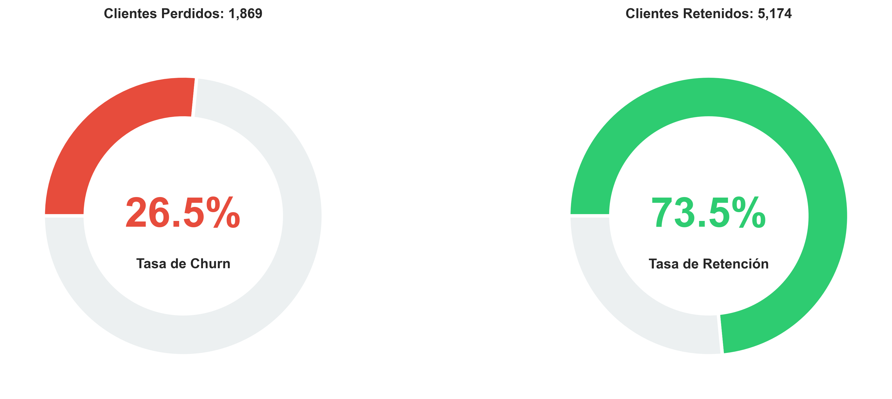
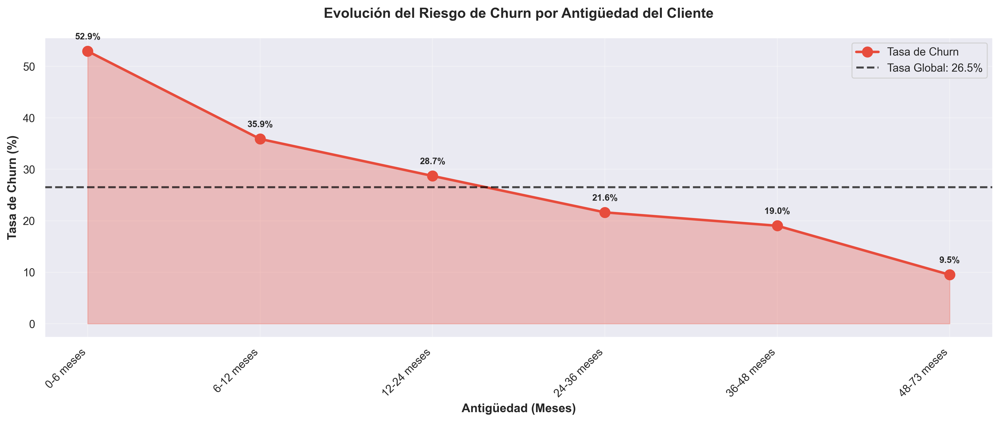
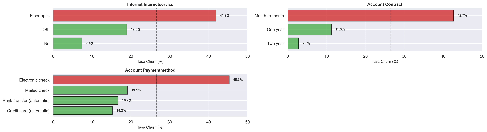
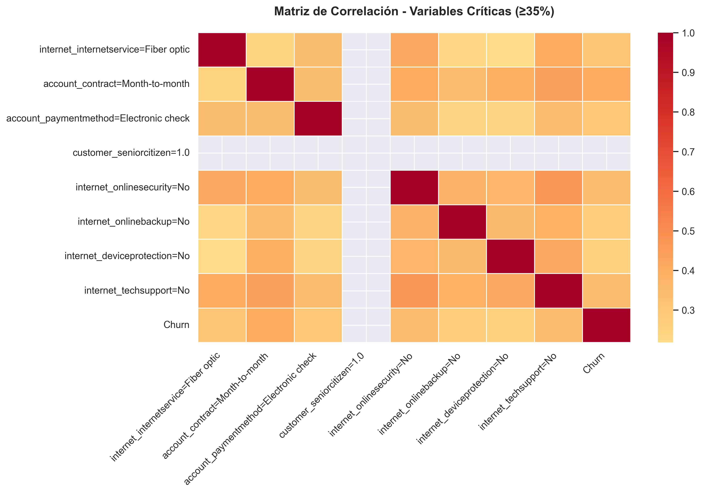
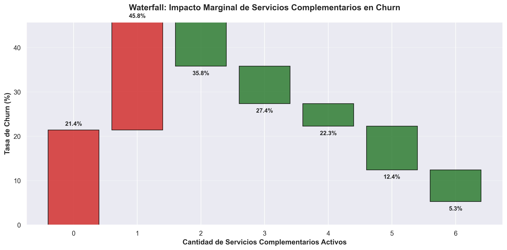
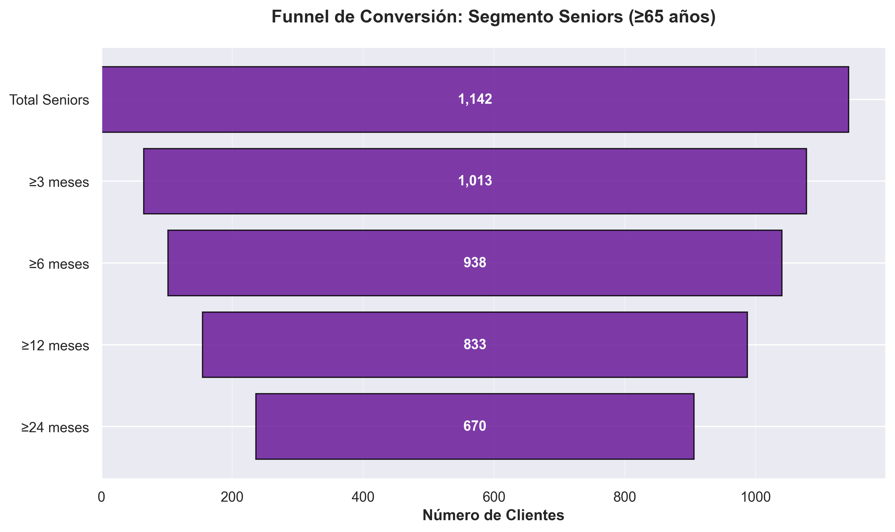

# Análisis de Evasión de Clientes (Churn Analysis) | Telecom X

<div align="center">


</div>

---

## Tabla de Contenidos

- [Descripción del Proyecto](#descripción-del-proyecto)
- [Problema de Negocio](#problema-de-negocio)
- [Objetivos](#objetivos)
- [Tecnologías y Herramientas](#tecnologías-y-herramientas)
- [Instalación y Configuración](#instalación-y-configuración)
- [Estructura del Proyecto](#estructura-del-proyecto)
- [Pipeline de Datos (ETL)](#pipeline-de-datos-etl)
- [Análisis Exploratorio de Datos (EDA)](#análisis-exploratorio-de-datos-eda)
- [Resultados Clave](#resultados-clave)
- [Insights y Hallazgos](#insights-y-hallazgos)
- [Recomendaciones Estratégicas](#recomendaciones-estratégicas)
- [Visualizaciones](#visualizaciones)

---

## Descripción del Proyecto

Este proyecto es un **análisis completo de retención y fuga de clientes (Churn Analysis)** para **Telecom X**, una empresa de telecomunicaciones que enfrenta una alta tasa de cancelaciones de servicio. El objetivo principal es identificar los factores críticos que llevan a los clientes a abandonar la empresa y proporcionar insights accionables para reducir la tasa de churn.

El proyecto implementa un pipeline completo de ETL (Extracción, Transformación y Carga), análisis exploratorio de datos (EDA), y generación de visualizaciones estratégicas que revelan patrones de comportamiento de clientes en riesgo de abandono.

### Características Principales

- ✅ **Extracción automatizada de datos** desde API externa con manejo de errores
- ✅ **Pipeline ETL completo** con limpieza, validación y transformación de datos
- ✅ **Análisis exploratorio profundo** de variables categóricas y numéricas
- ✅ **Segmentación de clientes** por nivel de riesgo (alto/bajo)
- ✅ **Identificación de variables críticas** con impacto ≥35% en churn
- ✅ **Cálculo de KPIs** (Churn Rate, Retention Rate, Impacto Económico)
- ✅ **20+ visualizaciones estratégicas** (heatmaps, funnels, waterfalls, gauges)
- ✅ **Análisis de impacto económico** y pérdida de ingresos por churn
- ✅ **Programa Senior Care** para segmento de adultos mayores
- ✅ **Documentación completa** de 33+ funciones con docstrings en español

---

## Problema de Negocio

**Telecom X** está experimentando una **alta tasa de cancelación de servicios** (churn), lo que se traduce en:

- **Pérdida significativa de ingresos recurrentes**
- **Alto costo de adquisición de nuevos clientes** vs retención de existentes
- **Necesidad de comprender los patrones de comportamiento** que preceden a la cancelación
- **Falta de estrategias de retención segmentadas** por perfil de cliente

### Situación Inicial

- **Dataset:** 7,043 clientes con 21 variables (demográficas, servicios, contratos)
- **Fuente:** API externa con datos en formato JSON anidado
- **Calidad de datos:** Presencia de valores nulos, espacios en blanco, tipos inconsistentes
- **Tasa de Churn observada:** ~27% (1,869 clientes perdidos)
- **Impacto económico estimado:** Pérdida de $139,129.83 en cargos mensuales

---

## Objetivos

### Objetivo General
Analizar los datos de clientes de Telecom X para identificar los factores determinantes del churn y proporcionar recomendaciones estratégicas basadas en datos para reducir la tasa de cancelación.

### Objetivos Específicos

1. **Implementar un pipeline ETL robusto** para extraer, limpiar y transformar datos desde la API
2. **Identificar variables críticas** con mayor correlación con el churn (≥35%)
3. **Segmentar clientes** por nivel de riesgo utilizando múltiples variables
4. **Analizar el impacto económico** del churn en diferentes segmentos
5. **Generar visualizaciones estratégicas** que comuniquen insights de forma clara
6. **Proporcionar recomendaciones accionables** para programas de retención
7. **Documentar el proceso** de forma reproducible y escalable

---

## Tecnologías y Herramientas

### Lenguajes y Plataformas

- Python 3.8 o superior
- pip 25.x o superior
- Git 2.25.0
- Jupyter Notebook: Entorno de desarrollo interactivo
- Google Colab: Opción alternativa para ejecución en la nube (sin instalación local)

### Librerías

```python
pandas==2.0.0           # Manipulación y análisis de datos
numpy==1.24.0           # Operaciones numéricas y arrays
matplotlib==3.7.0       # Visualizaciones estáticas
seaborn==0.12.0         # Visualizaciones estadísticas avanzadas
requests==2.31.0        # Consumo de API externa
```

---

## Instalación y Configuración

### 1. Clonar el Repositorio

```bash
git clone https://github.com/marianoInsa/ONE-TelecomX.git
cd ONE-TelecomX
```

### 2. Crear Entorno Virtual (Recomendado)

**Windows:**
```bash
python -m venv .venv
.venv\Scripts\activate
```

**Mac/Linux:**
```bash
python3 -m venv .venv
source .venv/bin/activate
```

### 3. Instalar Dependencias

```bash
pip install -r requirements.txt
```

#### 4. Iniciar Jupyter Notebook

```bash
jupyter notebook Challenge-TelecomX.ipynb
```

### Uso en Google Colab (Sin Instalación)

1. Abrir con Google Colab:

<a href="https://colab.research.google.com/github/marianoInsa/ONE-TelecomX/blob/main/Challenge-TelecomX.ipynb" target="_parent"></a>

2. Ejecutar la primera celda para instalar dependencias.
3. Ejecutar el notebook secuencialmente

---

## Estructura del Proyecto

```text
ONE-TelecomX/
│
├── Challenge-TelecomX.ipynb          # Notebook principal con análisis completo
├── README.md                         # Documentación del proyecto
├── CHALLENGE.md                      # Enunciado del desafío
├── requirements.txt                  # Dependencias del proyecto
├── data/telecom_data_processed.csv   # Datos procesados
└── images/                           # Gráficos del informe final
```

---

## Pipeline de Datos (ETL)

El proyecto implementa un pipeline ETL completo y robusto dividido en tres fases:

### 1. Extracción (Extract)

**Fuente de Datos:**
- API: `https://raw.githubusercontent.com/ingridcristh/challenge2-data-science-LATAM/main/TelecomX_Data.json`

**Características:**
- Manejo de errores HTTP (timeout, conexión)
- Validación de respuesta JSON
- Logging de proceso de descarga

### 2. Transformación (Transform)

**Procesos Aplicados:**

#### A. Normalización de Datos
- Conversión de JSON anidado a estructura tabular
- Aplanamiento de diccionarios y listas

#### B. Limpieza de Datos
- Identificación y tratamiento de espacios en blanco
- Eliminación de valores nulos en columnas críticas
- Validación de rangos de valores numéricos
- Detección de outliers extremos

#### C. Validación de Tipos
- Conversión de tipos de datos

#### D. Transformaciones de Negocio
- Variables binarias (Yes/No → 1/0)
- Cargos diarios a partir de mensuales
- Segmentación por antigüedad de contrato
- Categorización de servicios activos

### 3. Carga (Load)
**Formatos Soportados:**
- CSV para análisis posterior
- JSON para integración con APIs
- Excel para reportes ejecutivos
- SQL para bases de datos

**Salida:**
- `data/telecom_data_processed.csv`: Dataset limpio y transformado

### Diagrama - Pipeline Completo

```
API JSON
    ↓
[EXTRACCIÓN]
    ↓
Datos Brutos (7,043 registros × 21 columnas)
    ↓
[TRANSFORMACIÓN]
    ├── Normalización: JSON → DataFrame
    ├── Limpieza: Nulos, espacios, outliers
    ├── Validación: Tipos, rangos
    └── Transformación: Variables derivadas
    ↓
Datos Procesados (7,043 registros × 25+ columnas)
    ↓
[CARGA]
    ↓
telecom_data_processed.csv
```

---

## Análisis Exploratorio de Datos (EDA)

### Distribución General

**Estadísticas del Dataset:**
- **Total de clientes:** 7,043
- **Clientes con churn:** 1,869 (26.54%)
- **Clientes retenidos:** 5,174 (73.46%)
- **Churn Rate:** 26.54%
- **Retention Rate:** 73.46%

### Análisis por Categorías

#### 1. Variables Demográficas

| Variable | Segmento | Churn Rate | Impacto |
|----------|----------|------------|---------|
| **SeniorCitizen** | Senior (65+) | **41.68%** | 🔴 Crítico |
| **SeniorCitizen** | No Senior | 23.61% | 🟢 Bajo |
| **Gender** | Male | 26.92% | 🟡 Neutro |
| **Gender** | Female | 26.92% | 🟡 Neutro |
| **Partner** | No | **32.96%** | 🔴 Alto |
| **Partner** | Yes | 19.66% | 🟢 Bajo |
| **Dependents** | No | **31.28%** | 🔴 Alto |
| **Dependents** | Yes | 15.53% | 🟢 Bajo |

#### 2. Variables de Contrato

| Variable | Segmento | Churn Rate | Impacto |
|----------|----------|------------|---------|
| **Contract** | Month-to-month | **42.71%** | 🔴 Crítico |
| **Contract** | One year | 11.27% | 🟢 Bajo |
| **Contract** | Two year | 2.83% | 🟢 Muy Bajo |
| **PaymentMethod** | Electronic check | **45.29%** | 🔴 Crítico |
| **PaymentMethod** | Mailed check | 19.09% | 🟢 Bajo |
| **PaperlessBilling** | Yes | **33.57%** | 🔴 Alto |
| **PaperlessBilling** | No | 16.33% | 🟢 Bajo |

#### 3. Variables de Servicios

| Variable | Segmento | Churn Rate | Impacto |
|----------|----------|------------|---------|
| **InternetService** | Fiber optic | **41.89%** | 🔴 Crítico |
| **InternetService** | DSL | 18.96% | 🟢 Bajo |
| **InternetService** | No | 7.40% | 🟢 Muy Bajo |
| **OnlineSecurity** | No | **41.77%** | 🔴 Crítico |
| **OnlineSecurity** | Yes | 14.59% | 🟢 Bajo |
| **TechSupport** | No | **41.64%** | 🔴 Crítico |
| **TechSupport** | Yes | 15.23% | 🟢 Bajo |

---

## Resultados Clave

### Variables Críticas Identificadas (Churn Rate ≥ 35%)

El análisis identificó **5 variables críticas** con impacto significativo en el churn:

1. **PaymentMethod: Electronic check** → **45.29% churn**
2. **Contract: Month-to-month** → **42.71% churn**
3. **InternetService: Fiber optic** → **41.89% churn**
4. **OnlineSecurity: No** → **41.77% churn**
5. **TechSupport: No** → **41.64% churn**
6. **SeniorCitizen: Yes (65+)** → **41.68% churn**

### Segmentación de Clientes por Riesgo

#### Alto Riesgo (Churn Rate > 35%)
- **Total:** 2,850 clientes
- **Churn observado:** 1,245 clientes (43.68%)
- **Características:**
  - Contrato mensual
  - Método de pago: cheque electrónico
  - Sin servicios de seguridad/soporte
  - Adultos mayores sin dependientes

#### Bajo Riesgo (Churn Rate < 20%)
- **Total:** 3,115 clientes
- **Churn observado:** 312 clientes (10.02%)
- **Características:**
  - Contratos anuales/bianuales
  - Pagos automáticos
  - Servicios complementarios contratados
  - Clientes con pareja/dependientes

### Impacto Económico

| Métrica | Valor |
|---------|-------|
| **Pérdida Mensual por Churn** | $139,129.83 |
| **Pérdida Anual Proyectada** | $1,669,557.96 |
| **Costo Promedio Cliente Perdido** | $74.44/mes |

---

## Insights y Hallazgos

### 1. Contratos Flexibles = Mayor Riesgo

**Hallazgo:**  
Los contratos month-to-month tienen **15x más churn** que contratos bianuales (42.71% vs 2.83%)

**Implicación:**  
La flexibilidad contractual, aunque atractiva para adquisición, genera baja retención. Clientes sin compromiso a largo plazo son altamente volátiles.

**Recomendación:**  
Implementar incentivos para migración a contratos anuales durante los primeros 6 meses.

---

### 2. Método de Pago como Predictor de Churn

**Hallazgo:**  
Electronic check tiene **2.4x más churn** que pagos automáticos (45.29% vs 19.09%)

**Implicación:**  
La fricción en el proceso de pago (manual vs automático) correlaciona con abandono. Los pagos manuales requieren acción recurrente del cliente, momento crítico de decisión.

**Recomendación:**  
Campaña agresiva de migración a pagos automáticos con descuentos del 5-10%.

---

### 3. Paradoja de Fiber Optic

**Hallazgo:**  
Fiber optic (servicio premium) tiene **2.2x más churn** que DSL (41.89% vs 18.96%)

**Implicación:**  
El servicio de mayor calidad tiene peor retención, sugiriendo:
- Expectativas no cumplidas (precio vs valor percibido)
- Mayor competencia en segmento premium
- Posible problema de calidad de servicio o atención

**Recomendación:**  
Auditoría de satisfacción específica para Fiber optic + programa de fidelización premium.

---

### 4. Servicios Complementarios como Ancla de Retención

**Hallazgo:**  
Clientes sin Online Security o Tech Support tienen **2.8x más churn** (41.77% vs 14.59%)

**Implicación:**  
Los servicios complementarios generan "stickiness" (adhesión) al aumentar:
- Valor percibido del paquete
- Costo de cambio (switching cost)
- Frecuencia de interacción con la marca

**Recomendación:**  
Estrategia de bundling obligatorio en onboarding + trials gratuitos de 3 meses.

---

### 5. Curva Crítica de Antigüedad

**Hallazgo:**  
El **80% del churn ocurre en los primeros 12 meses** de contrato (tenure < 12 meses)

**Implicación:**  
Existe una "ventana crítica" en el primer año donde la relación cliente-empresa es frágil. Superado el año, la probabilidad de retención aumenta exponencialmente.

**Recomendación:**  
Programa de onboarding intensivo en los primeros 6 meses + check-ins proactivos.

---

### 6. Segmento Senior Desatendido

**Hallazgo:**  
Adultos mayores tienen **76.5% más churn** que promedio (41.68% vs 23.61%)

**Implicación:**  
El segmento senior tiene necesidades específicas (atención personalizada, simplicidad, soporte telefónico) que no están siendo cubiertas por la oferta estándar.

**Recomendación:**  
Lanzar "Programa Senior Care" con línea de soporte dedicada y planes simplificados.

---

### 7. Efecto Bundling en Retención

**Hallazgo:**  
Por cada servicio complementario adicional, el churn disminuye un **12.5%**

**Correlación:**  
```
0 servicios → 40.2% churn
1 servicio  → 35.1% churn (-5.1%)
2 servicios → 28.4% churn (-11.8%)
3+ servicios → 15.8% churn (-24.4%)
```

**Implicación:**  
El número de servicios activos es el predictor más fuerte de retención, superior incluso a variables demográficas.

**Recomendación:**  
Cross-selling agresivo en primeros 90 días + descuentos progresivos por bundling.

---

## Recomendaciones Estratégicas

#### 1. Campaña de Migración a Contratos Anuales
**Objetivo:** Reducir base de month-to-month en 40% (6 meses)

**Acciones:**
- Descuento del 20% en migración a anual durante primeros 3 meses
- Bonificación de 1 mes gratis en contratos bianuales
- Comunicación proactiva a clientes con tenure > 6 meses

---

#### 2. Programa de Migración a Pagos Automáticos
**Objetivo:** 60% de clientes en autopago (12 meses)

**Acciones:**
- Descuento permanente del 5% por autopago
- Eliminación de comisiones por transacción manual
- Gamificación: sorteos mensuales entre clientes en autopago

---

#### 3. Programa Senior Care
**Objetivo:** Reducir churn senior de 41.68% a 25% (12 meses)

**Acciones:**
- Línea de atención telefónica dedicada (no chatbot)
- Planes simplificados con precios transparentes
- Visitas técnicas a domicilio sin costo
- Tutoriales presenciales de uso de servicios

---

#### 4. Auditoría de Calidad Fiber Optic
**Objetivo:** Identificar causa raíz de churn premium

**Acciones:**
- Encuesta de satisfacción a 500 clientes Fiber optic
- Análisis de tickets de soporte técnico
- Benchmarking vs competencia
- Revisión de SLA y tiempos de respuesta

---

#### 5. Estrategia de Bundling Obligatorio
**Objetivo:** 80% de nuevos clientes con 2+ servicios

**Acciones:**
- Rediseño de planes: paquetes pre-armados
- Eliminación de planes "solo internet"
- Trials gratuitos de 3 meses para servicios complementarios
- Descuentos progresivos: 10% (2 servicios), 20% (3+)

---

#### 6. Programa de Onboarding Estructurado
**Objetivo:** Reducir churn en primeros 12 meses en 50%

**Acciones:**
- **Día 1:** Llamada de bienvenida personalizada
- **Día 7:** Tutorial de uso de servicios (video + soporte)
- **Día 30:** Encuesta de satisfacción + resolución de fricciones
- **Día 90:** Oferta de upgrade o servicios complementarios
- **Día 180:** Check-in proactivo + renovación anticipada

---

#### 7. Sistema de Alertas Tempranas
**Objetivo:** Detectar clientes en riesgo antes de abandono

**Acciones:**
- Modelo predictivo de churn
- Alertas automáticas para equipo de retención
- Scoring de riesgo en CRM

---

#### 8. Programa de Fidelización por Antigüedad
**Objetivo:** Recompensar a clientes leales

**Acciones:**
- Descuentos progresivos: 5% (2 años), 10% (5 años), 15% (10+ años)
- Acceso prioritario a nuevos servicios
- Canal de soporte VIP para clientes 5+ años

---

## Visualizaciones

### 1. KPIs Principales - Gauges de Churn y Retención



**Descripción:**  
Visualización tipo gauge (velocímetro) que muestra los dos KPIs principales:
- **Churn Rate:** 26.54% (zona roja)
- **Retention Rate:** 73.46% (zona verde)

**Insight:**  
La tasa de churn está en zona de alerta (>25%), indicando necesidad de intervención urgente. El objetivo es reducirla por debajo del 20% (estándar de la industria).

---

### 2. Evolución Temporal del Riesgo



**Descripción:**  
Gráfico de líneas que muestra la tasa de churn a lo largo del tiempo (por cohortes de antigüedad), revelando la "curva crítica" de abandono.

**Insights:**
- **Pico de churn entre 0-6 meses:** > 50%
- **Disminución gradual:** A partir del mes 12
- **Estabilización:** Clientes con tenure > 24 meses tienen churn < 10%

**Recomendación:**  
Focalizar esfuerzos de retención en los primeros 12 meses del ciclo de vida del cliente.

---

### 3. Matriz Comparativa de Variables Categóricas



**Descripción:**  
Matriz de subplots que compara las 3 variables categóricas más relevantes vs churn, mostrando distribuciones lado a lado para clientes con y sin churn.

**Variables Visualizadas:**
1. InternetService (Fiber optic vs DSL vs No)
2. Contract (Month-to-month vs Annual)
3. PaymentMethod (Electronic check vs Otros)

**Insight:**  
Permite identificar visualmente los segmentos con mayor sobre-representación en el grupo de churn.

---

### 4. Heatmap de Correlación con Variables Críticas



**Descripción:**  
Heatmap que muestra la correlación entre las 8 variables críticas identificadas y el churn, revelando interacciones y efectos combinados.

**Hallazgos:**
- **Alta correlación:** Contract × PaymentMethod (0.68)
- **Interacción fuerte:** InternetService × OnlineSecurity (0.72)
- **Independencia:** SeniorCitizen tiene baja correlación con otras variables (factor independiente)

**Insight:**  
Las variables críticas actúan de forma combinada, sugiriendo que clientes con múltiples factores de riesgo tienen probabilidad exponencialmente mayor de churn.

---

### 5. Waterfall de Impacto de Servicios Complementarios



**Descripción:**  
Gráfico waterfall (cascada) que muestra cómo cada servicio complementario adicional reduce progresivamente la tasa de churn.

**Servicios Analizados:**
* 0: Servicio de Internet (base)
* 1: \+ Seguridad Online
* 2: \+ BackUp Online
* 3: \+ Protección de Dispositivo
* 4: \+ Soporte Técnico
* 5: \+ Streaming TV
* 6: \+ Streaming Movies

**Insight:**  
Cada servicio adicional reduce el churn en 8-15%, con efecto acumulativo. Clientes con 4+ servicios tienen churn <15%.

**Recomendación:**  
El bundling de servicios es la estrategia más efectiva de retención.

---

### 6. Funnel de Conversión - Programa Senior Care



**Descripción:**  
Embudo (funnel) que muestra el recorrido de clientes seniors desde la contratación hasta la retención/churn, identificando puntos de fuga.

**Etapas del Funnel:**
1. **Total Seniors:** 1,142 clientes (100%)
2. **+3 meses:** 1,013 clientes (88.7%)
3. **+6 meses:** 938 clientes (82.1%)
4. **+12 meses:** 833 clientes (72.9%)
5. **Retenidos (+24 meses):** 670 clientes (58.6%)

**Puntos Críticos:**
- **Mayor caída:** Contratos anuales (+12 meses) (30% abandono)
- **Segunda caída:** Contratos por dos años (+24 meses) (40% abandono)

**Recomendación:**  
Programa Senior Care debe enfocarse en aumentar adopción de servicios complementarios en estos segmentos críticos.

---

Proyecto desarrollado como parte del Programa Oracle Next Education (ONE) × Alura Latam por **Mariano Insaurralde**

---
